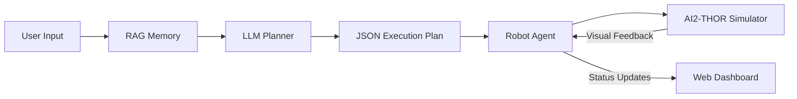

# 🤖 VCRL-DKR: Visual-Conversational Reinforcement Learning Agent
### with Dynamic Knowledge Retrieval & Embodied AI


## 📖 Executive Summary
**VCRL-DKR** is a state-of-the-art **Neuro-Symbolic AI system** designed to bridge the gap between high-level natural language understanding and low-level physical robotic interaction. 

Unlike traditional chatbots that live in text, this agent acts in a **photorealistic 3D world** (AI2-THOR). It utilizes a "Brain-Body" architecture where a Large Language Model (LLM) acts as the Planner, Computer Vision (YOLO) acts as the Eyes, and Reinforcement Learning (RL) provides autonomous navigation capabilities.

---

## 🌟 Key Capabilities

### 1. 🧠 Cognitive Reasoning (The Brain)
* **Contextual Awareness:** Uses **RAG (Retrieval-Augmented Generation)** to recall household facts (e.g., *"Where is the remote?"* -> *"It's usually on the sofa"*).
* **Dynamic Planning:** Converts abstract requests like *"I am hungry"* into actionable physical steps (`GOTO Kitchen` -> `OPEN Fridge` -> `GRAB Food`).

### 2. 👁️ Visual Perception (The Eyes)
* **Object Detection:** Integrated **YOLOv8** to identify objects in real-time from the robot's camera feed.
* **Semantic Mapping:** Maps natural language words (e.g., "Couch") to visual classes (e.g., "Sofa").

### 3. 🦾 Physical Interaction (The Body)
* **Manipulation:** Capable of **Opening** doors, **Closing** containers, **Grabbing** objects, and **Dropping** items.
* **Visual Servoing:** Implements intelligent **Approach Logic**—the robot spots an object from a distance, rotates to face it, and walks until it is within arm's reach (1.0m) before interacting.

### 4. 🧭 Hybrid Navigation (The Feet)
* **Teleportation:** For known semantic locations (Kitchen, Bedroom).
* **RL Wandering:** A trained **PPO (Proximal Policy Optimization)** agent that can autonomously explore unknown environments without colliding with walls.

# VCRL_DKR Project



## 📂 Directory Structure

```text
VCRL_DKR/
├── app.py                 # Main Web Application (Streamlit Interface)
├── config.py              # Configuration Settings & API Keys
├── requirements.txt       # Dependency List
├── .env                   # API Keys (Hidden)
├── models/
│   ├── yolov8n.pt         # Computer Vision Model
│   └── ppo_nav/           # Trained Reinforcement Learning Brain
└── modules/
    ├── agent.py           # Robot Control Logic (Movement, Physics, RL)
    ├── knowledge.py       # RAG System (ChromaDB Vector Store)
    ├── planner.py         # LLM Interface (Prompt Engineering)
    └── vision.py          # YOLO Wrapper for Object Detection
```

## ⚙️ Installation & Setup

### 1. Prerequisites
* **OS:** macOS (Silicon/Intel), Windows 10/11, or Linux.
* **Python:** Version 3.10 or 3.11 (Strict requirement for AI2-THOR).

### 2. Setup Virtual Environment

```bash
# Create environment
python -m venv venv

# Activate (Mac/Linux)
source venv/bin/activate

# Activate (Windows)
.\venv\Scripts\activate
```

### 3. Install Dependencies

```bash
pip install -r requirements.txt
```

### 4. Configure Secrets
Create a file named `.env` in the root directory:

```env
GROQ_API_KEY="gsk_your_actual_key_here"
# OPENAI_API_KEY="sk_..." (Optional fallback)
HEADLESS_MODE="False"
```

### 5. Run the Application

```bash
streamlit run app.py
```

---

## 🚀 Usage Scenarios

### Scenario 1: The "Grand Finale" (Full Stack Demo)
**User:** "I am hungry. Find an apple in the fridge and bring it to me."
**Behavior:**
1.  Planner infers location (Kitchen/Fridge).
2.  Agent navigates to Kitchen.
3.  Agent Opens the Fridge door.
4.  Vision detects Apple inside.
5.  Agent Grabs Apple.
6.  Agent returns to User and Drops the Apple.

### Scenario 2: Object Permanence & Physics
**User:** "Open the microwave, check for food, and then close it."
**Behavior:**
1.  Robot approaches microwave.
2.  Rotates to face it perfectly (Visual Servoing).
3.  Opens door -> Scans -> Closes door.

### Scenario 3: Autonomous Exploration
**User:** "Go to the bedroom and wander around."
**Behavior:**
1.  Teleports to Bedroom.
2.  Switches to RL Mode (Neural Network).
3.  Drives autonomously avoiding obstacles.

---

## 🧠 Technical Modules Breakdown

| Module | Description |
| :--- | :--- |
| **planner.py** | Uses Few-Shot Prompting with Llama-3 to generate strict JSON plans. Includes a robust Regex parser to handle LLM verbosity. |
| **agent.py** | The core controller. Implements Visual Servoing (approach logic), Head Tracking (calculating pitch/yaw to face objects), and PPO Integration for wandering. |
| **vision.py** | Wraps YOLOv8. Includes logic to map synonyms (e.g., "Couch" = "Sofa") and adjustable confidence thresholds. |
| **gym_env.py** | A custom OpenAI Gym wrapper used to train the PPO agent on 84x84 grayscale images from the simulator. |

---

## 🛠️ Future Scope

* **SLAM (Simultaneous Localization and Mapping):** Currently, the robot uses a pre-defined coordinate map. Future work involves building this map dynamically
* **Voice Interaction:** Integrating Whisper (STT) and ElevenLabs (TTS) for full verbal communication.
* **Open Vocabulary Vision:** Replacing YOLO with CLIP or DETIC to detect any object in the world without pre-training on specific classes.

## 👨‍💻 Author - YASHI
